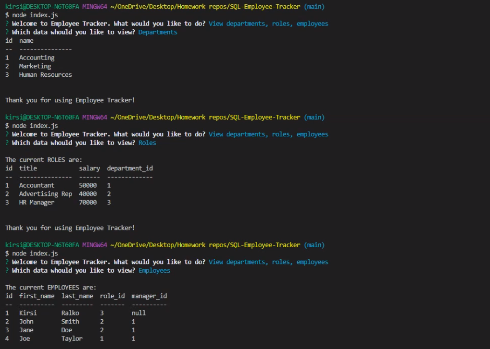

# SQL-Employee-Tracker

## Description 

* [Github Repository](https://github.com/kirsralk/SQL-Employee-Tracker).
* [Tutorial on Screencastify](https://drive.google.com/file/d/1EnLtpP6rwAFPQ0TcvvmuKazP_iw1UVzz/view?usp=sharing).

SQL-Employee-Tracker is a CLI based app that allows users to create and modify a workplace database using MySQL using the following schema:


* App Screenshot:



### User Story

```
As a business owner
I want to be able to view and manage the departments, roles, and employees in my company
So that I can organize and plan my business
```

## Installation

Note: This application runs on a Command Line Interface only (not in a browser) and requires [MySQL](https://dev.mysql.com/doc/mysql-installation-excerpt/5.7/en/).


### Step 1: Install Node

Ensnure you have the Node.js runtime environment installed on your machine.  Helpful instructions to install Node are available [here](https://coding-boot-camp.github.io/full-stack/nodejs/how-to-install-nodejs).

You can confirm if Node is properly installed on your machine by running the command "node -v" in your terminal, which will return the Node verison number you have installed. 

This project was created using Node v.14.15.4.

### Step 2: Install the Default NPM Package

Install the NPM CLI modules package by running the command "npm install" in your terminal.

By default, this will install all modules listed as dependencies in a new subfolder called node_modules and the package.json file.


### Step 3: Install Additional Required Dependencies:

* Install the additional NPM package Inquirer by running the command "npm install inquirer" in your terminal.
* Install the additional NPM package Express by running the command "npm install express" in your terminal.
* Install the additional NPM package MySQL by running the command "npm install mysql" in your terminal.
* Install the console.table NPM package for MySQL by running the command "npm install console.table --save" in your terminal.

These commands will install additional node_module files and package-lock.json.

You are now ready to use the SQL-Employee-Tracker app!


## Usage 

* To create and pre-populate your database, execute the schema.sql and seed.sql files (located in assets/db/) in MySQL Workbench or via terminal using the NPM mysql command.

* Invoke the application by running the "index.js" file within the Node environment (run the command "node index.js" in your terminal).

* Follow the prompts to add, view, update or delete entries in your database.


## Credits

Created by Kirsi: https://github.com/kirsralk/


## License

[](https://opensource.org/licenses/MIT)